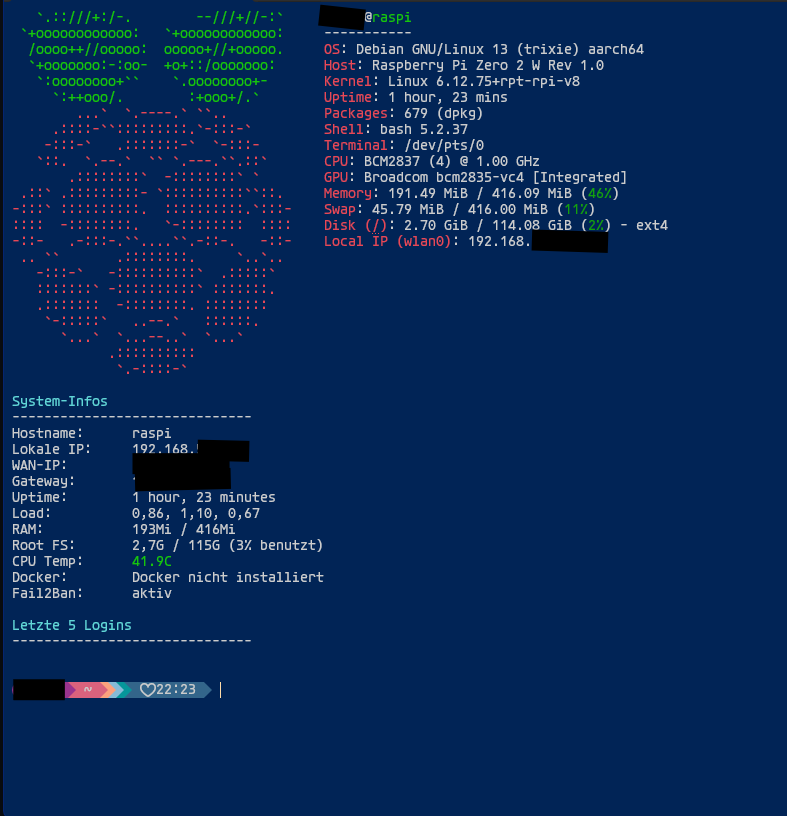

This repository contains a simple `bashrc.sh` script that automatically customizes and enhances your terminal experience.

## Installation

1. Clone the repository:

```bash
git clone <https://github.com/sudoAndro/linux-starter-kit.git>
```

2. Open your `.bashrc` file:

```bash
nano ~/.bashrc
```

3. Add this line at the bottom:

```bash
source /path/to/bashrc.sh
```

4. Save the file and reload your terminal:

```bash
bash
```

Or run:

```bash
source ~/.bashrc
```

That's it — the script will now automatically apply all configured changes and features.
